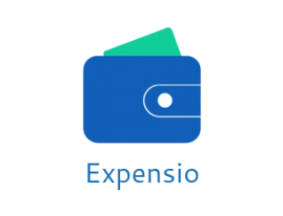
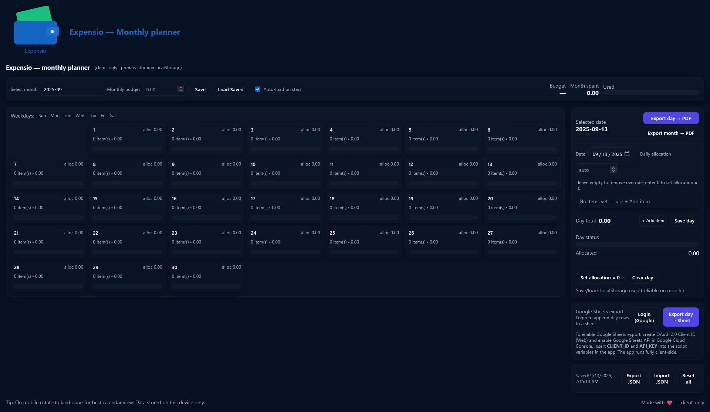
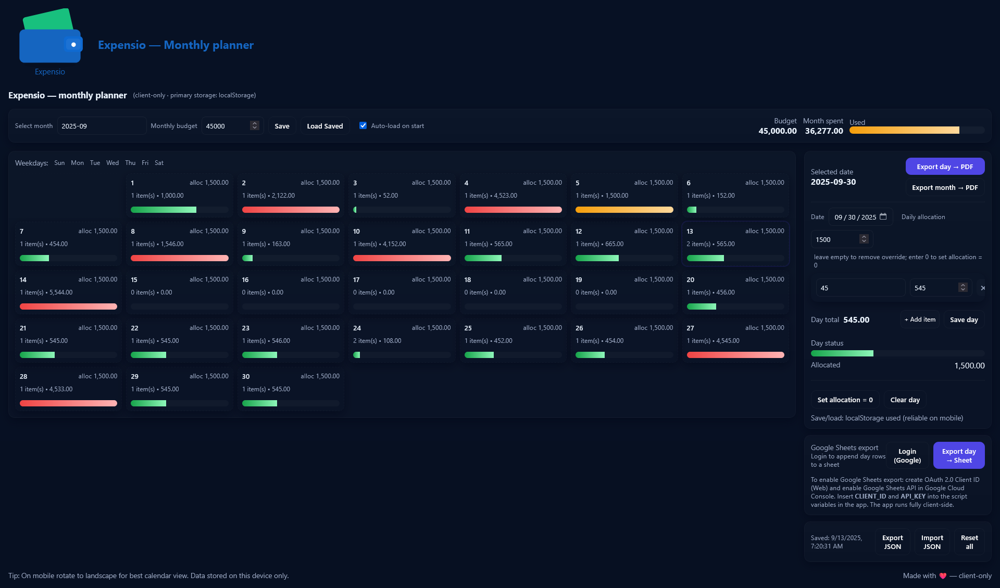

# Expensio

**Expensio** — a lightweight, spell-like expense tracker that runs in your browser. No installation required: open the HTML file on desktop or mobile and start tracking.

---

## Features
- Single-file web app (HTML/CSS/JS) — works in any modern browser.
- Save data locally (browser storage) so your expenses persist on the same device.
- Export your data (CSV/JSON) for backup or analysis.
- Responsive UI — usable on desktop, tablet, and mobile.
- Small, fast, privacy-friendly: your data stays in your browser unless you export it.

---

## Why use Expensio? (Pros)
- **No installation needed** — works in any modern browser (Windows, macOS, Linux, Android, iOS).
- **Mobile-friendly** — just open the HTML from your mobile browser or bookmark it; no app store required.
- **Save locally** — data is stored in the browser (localStorage), so you can keep a record without an external service.
- **Exportable** — export to CSV/JSON to move data between devices or keep backups.
- **Portable** — copy the `Expensio.html` file to a USB or cloud folder and open it anywhere.
- **Lightweight** — fast to open and simple to use.

---

## Quick start (run locally)
1. Clone the repo (or download the files):
   ```bash
   git clone <YOUR_REMOTE_REPO_URL>
   cd <repo-folder>
2. Open the app in a browser:
- Double-click Expense-Calculator.html, or
- Right-click → Open With → your browser, or
- Drag the HTML file into a browser tab.

Tip: On mobile, you can add the page to your home screen (browser-dependent) for quick access.

## Screenshots

Logo 


Home screen 


Sample Montly Data 


